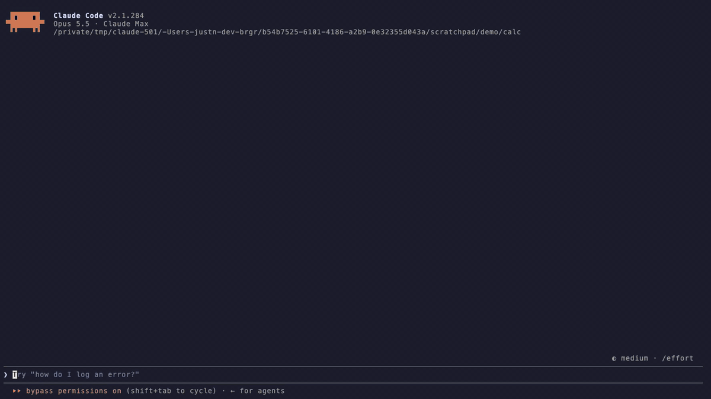

# brgr

**Let Codex or Claude Code hand work to other coding agents, each running in
its own [Herdr](https://github.com/herdrdev/herdr) pane beside you, without
anyone clicking through their prompts.**



*Above: one request to Claude Code. brgr opens three Claude Code workers beside
it, each worker's report comes back as a `FROM BRGR` notice, Claude accepts it,
and brgr closes that worker's pane. Shown at 2x speed.*

brgr brings the orchestration part of [Orca](https://github.com/stablyai/orca),
a desktop app for running many coding agents, to Herdr. Your agent stays the one
that decides. brgr starts the workers, clicks through the trust and continue
prompts that would stop them, and hands every result back for an explicit
accept or reject.

## What it does

- **Workers in panes, not in the background.** Each worker is the harness's own
  TUI in a Herdr pane. The first one splits your pane. Later ones stack under it
  at equal heights while you keep your half, and every brgr command evens the
  column out again. When a result is accepted or rejected its pane closes, and
  its worktree is removed once nothing in it would be lost (`--keep-worktree`
  keeps it).
- **Unattended.** brgr accepts workspace trust, "press Enter to continue"
  notices, and Claude Code's bypass warning and new-MCP-server prompt. It skips
  update offers. A screen it does not recognise is reported with its text and
  fails the run after three minutes, instead of waiting forever.
- **Results you decide on.** Each worker writes a report that brgr seals. brgr
  types a `FROM BRGR` notice into your agent's pane, and the agent reads the
  result and accepts or rejects it.
  A diff is applied only after an explicit accept.
- **Failures reach you.** A failed or lost run sends a failure notice with the
  reason. Every brgr command repeats it until you acknowledge it.
- **Talk both ways.** Owner and worker exchange questions and replies, workers
  can start their own child workers, and sibling workers can debate when you ask
  for it.

Workers can be Claude Code, Codex CLI, Gemini CLI, GitHub Copilot CLI, Pi,
OpenCode, Cursor CLI, Devin CLI, Cline, GJC, OMP or Command Code; brgr calls
each registered worker CLI a *harness*. The agent that starts workers, the
*owner*, can be a Codex or Claude Code session.

> **Workers always run with full permissions** (`--yolo`,
> `--dangerously-skip-permissions` and equivalents). That is the point of
> unattended orchestration, so only point brgr at code you trust. A clean Git
> repository gets a separate worktree for each task.

## Requirements

- Apple Silicon Mac with macOS 15 or newer
- [Herdr](https://github.com/herdrdev/herdr) 0.9 or newer, installed and
  running. Start your agent in a Herdr pane, so workers can open beside it.
- A Rust toolchain (`cargo`) to install. Release archives exist but are unsigned
  and not notarized; see [the unsigned distribution guide](docs/guides/unsigned-distribution.md).
- At least one worker CLI, installed and logged in, for example Claude Code

## Install

```bash
# 1. The brgr CLI
cargo install --git https://github.com/justn-hyeok/brgr --tag v2.13.0 --locked brgr-cli

# 2. Teach your agent how to use brgr
brgr integrate claude install    # Claude Code: installs the brgr skill
brgr integrate codex install     # Codex: installs the skill and session hooks

# 3. Register a worker. This runs one small prompt through it.
mkdir -p ~/brgr-scratch
brgr harness add "$(command -v claude)" --workspace ~/brgr-scratch --prompt "Reply with OK"
brgr doctor
```

`brgr doctor` prints JSON. It is ready when `"status"` is `"ok"` and the worker
you added shows `"health": "healthy"`. Then start a new Claude Code or Codex
session inside Herdr: an agent reads its skills when a session starts, so one
that was already running does not know brgr yet.

The Herdr plugin adds a task board and workspace actions on top:

```bash
herdr plugin install justn-hyeok/brgr --ref v2.13.0
```

## Use it

Inside Herdr, ask your agent in plain words, for example:

> Use brgr to have two Claude Code workers review this diff, one for bugs and
> one for missing tests. Accept the results that hold up.

The agent runs commands like these, which you can also run yourself:

```bash
brgr run "Review this change" --harness local.claude-code --criterion "findings cite changed lines"
brgr result TASK
brgr accept TASK --reason "criteria verified"
```

## Troubleshooting

| You see | What to do |
|---|---|
| `could not find the calling Codex pane` | Start each brgr command from Codex with `--as SESSION`; the installed skill does this. `brgr doctor` shows under `codex_trace` whether your Codex release was checked. |
| A worker fails with "insufficient credits", a usage limit or an HTTP 4xx | The worker's own account or model failed, not brgr. Use another harness, or pick a model with `brgr config set model MODEL --harness local.claude-code`. |
| `a screen no brgr rule answers` | The error quotes the screen. Answer it with `brgr input TASK --key KEY` or `--text TEXT`, and open an issue so a rule can be added. |
| `brgr doctor` shows a harness as `probe_evidence_changed` | Its CLI updated itself. Register it again with `brgr harness add PATH --workspace ~/brgr-scratch --prompt "Reply with OK"`. |
| A failure note after every brgr command | A failed run waits for you: inspect it with `brgr result TASK`, then `brgr result TASK --ack`. |

## Status

**Experimental.** v2 is used daily by its author, on macOS only, and changes
quickly; see the [changelog](CHANGELOG.md). The first stable release will be
**v3**. It waits on two checks: concurrency across several processes at once,
and a full review of the code by someone other than the author. See
[the readiness status](docs/readiness/status.md).

brgr is written by AI coding agents under one maintainer's direction, so its
code quality is not guaranteed; its behaviour is what the tests check.
[CONTRIBUTING.md](CONTRIBUTING.md) says what that means and how to help.

The detailed contract, covering plugin internals, routes, pane mode, recursive
workers, the completion loop and worktree cleanup, is in
[docs/guides/reference.md](docs/guides/reference.md).
